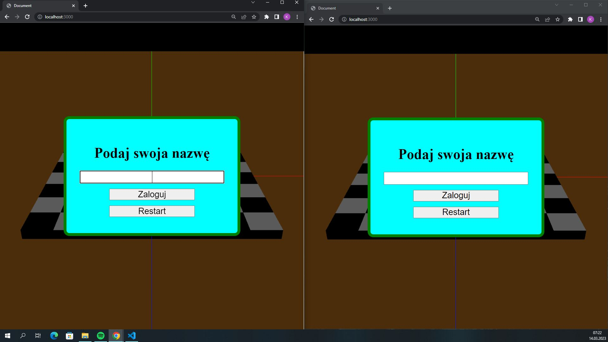
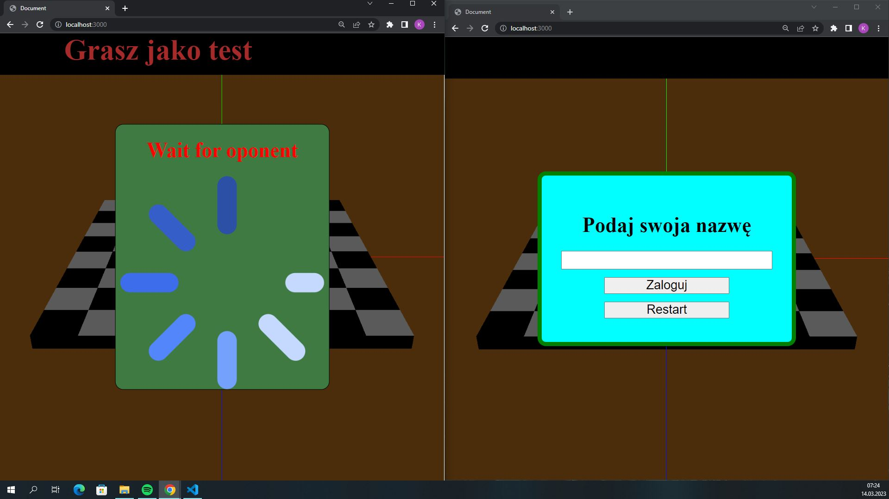
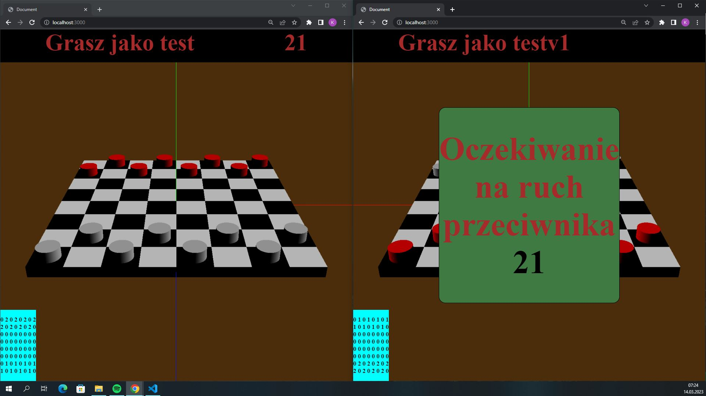
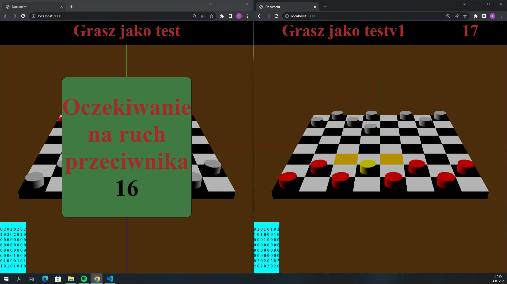

<h1>Checkers</h1>

Game was made with using: webgl, treejs and express 

<h2>About game</h2>

You can play with 2 players on the same computer by start application and write localhost:3000 

<h2>Warning</h2>

In game you can use only pawn and when you go to end of board you can't move that pawn (Game in not finished)

<h2>How to start game?</h2>
<ol>
  <li>Make sure that you have installed git command line and nodejs</li>
  <li>Create empty folder</li>
  <li>Open new folder in cmd</li>
    <li>Write commands:
    <ol type="a" >
      <li><code>git init</code></li>
      <li><code>git pull https://github.com/szariii/Checkers.git</code></li>
      <li><code>npm ci</code></li>
      <li><code>node .\server.js</code></li>
    </ol>
  </li>
  <li>Write localhost:3000 in browser to start a game (you need to play with second player on the same computer)</li>
</ol>

<h2>Screenshots</h2>

